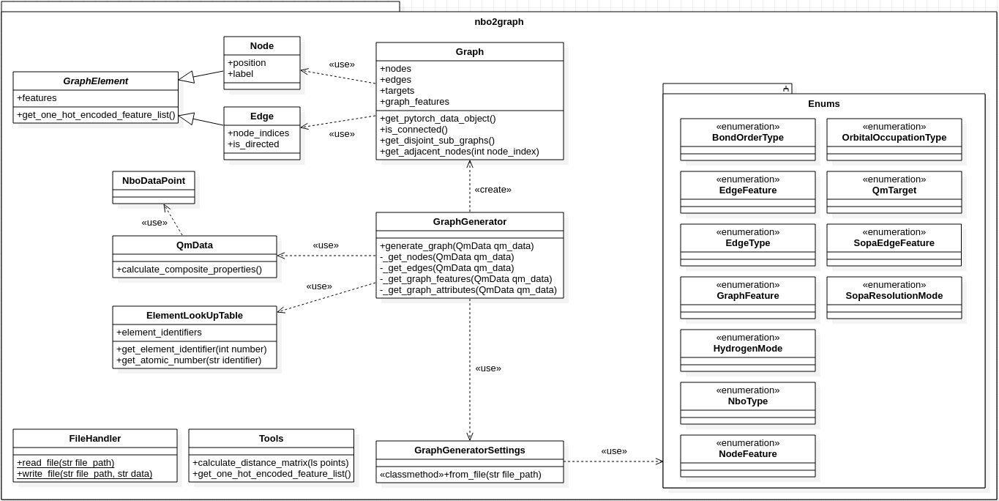

===============================
HyDGL
===============================

.. image:: https://circleci.com/gh/hkneiding/HyDGL.svg?style=svg&circle-token=dcb019393b2ff6c2e7afef3f326541f79366f256
    :target: https://circleci.com/gh/hkneiding/HyDGL
.. image:: https://codecov.io/gh/hkneiding/HyDGL/branch/main/graph/badge.svg?token=UB88TKUCY7
    :target: https://codecov.io/gh/hkneiding/HyDGL
.. image:: https://readthedocs.org/projects/docs/badge/?version=
    :target:

``HyDGL`` is a Python parser to generate descriptive graphs based on quantum chemistry data ready for use in Graph Neural Networks. In particular it provides the following features:

- adaptable generation of graph representations based on quantum chemistry data

    - connectivity based on NBO data or bond orders
    - features (both periodic table properties and quantum chemistry based)

- export of graphs as networkx objects or pytorch_geometric graphs

So far most graph representation learning approaches in quantum chemistry focus on organic molecules and build graphs based on geometry using basic features. For the accurate prediction of more complicated compounds (such as transition metal complexes) richer representations are required that include more of the relevant physics. This package provides the functionality to generate such graphs mainly based on Natural Bond Orbital (NBO) data and is the code associated with the paper `Deep Learning Metal Complex Properties with Natural Quantum Graphs`_.

.. _Deep Learning Metal Complex Properties with Natural Quantum Graphs: https://chemrxiv.org/engage/chemrxiv/article-details/62b8daaf7da6ce76b221a831 

The package can be used for any types of molecules but is aimed at transition metal complexes, more precisely the tmQM data set.

Requirements
-----------

This package requires a Python (>3.9.x) installation with the following packages:

- ``pytorch``
- ``pytorch_geometric``
- ``plotly``

How to use
-----------

The package can be installed directly from this repository with ``pip``::
    
    pip install git+https://github.com/hkneiding/HyDGL

which installs ``HyDGL`` as a library to your Python installation or virtual environment.

Afterwards you can import the library with:

>>> import HyDGL

A more detailed guide on the usage can be found in the `documentation <link>`_.

What is under the hood?
-----------

There are two main parts in the ``HyDGL`` package. The first one is the ``GraphGenerator`` class that generates graphs based to specified parameters. Secondly there is the ``Graph`` class which represents a full graph in terms of nodes, edges, their respective features, graph-level features and attributes/labels. Furthemore, it includes functionality to produce object in a format ready to use with the ``pytorch_geometric`` package. The remaining classes are mainly miscellaneous helper classes and enums.\
This general structure is displayed by the following UML diagram.

Difficulties?
-----------

If you encounter any problems, errors or bugs please do not hesitate to open an issue or directly contact me via mail (hanneskn@uio.no).
